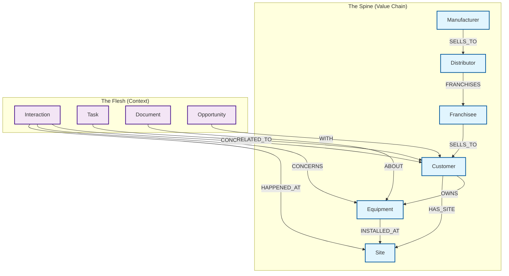

# Core Concepts

## Data Model Architecture

The schema is organized into two primary layers: the **Spine** (structural value chain) and the **Flesh** (dynamic context).

## 1.1 What Are Entities?

**Entities** are the stable **nouns** in our business domain that:

-   Represent real-world things that exist and matter across workflows
-   Participate in multiple relationships with other entities
-   Are queried from many angles by different agents
-   Are long-lived (years, not days/weeks)

**Examples**: Companies, People, Equipment, Sites, Products, Orders

## 1.2 What Are Relationships?

**Relationships** connect entities and represent:

-   Explicit facts about how entities relate to each other
-   Directional connections (though Neo4j can traverse both ways)
-   Context through relationship properties (dates, roles, status, etc.)

**Relationship Design Principles**:

-   Choose ONE direction based on primary query pattern
-   Don't create bidirectional redundant relationships
-   Use relationship properties for temporal/contextual information
-   Only create relationships that are explicitly stated or strongly implied

## 1.3 What Are Properties?

**Properties** are attributes that describe entities or relationships. All listed properties are **suggested** for extraction if present in the source data.

**Node Properties**:

-   Follow standardized formats (ISO dates, ISO currency codes, etc.)
-   Extract as many as possible from the source text
-   Use `null` or omit if not found (do not hallucinate)

**Relationship Properties**:

-   Temporal: `startDate`, `endDate`, `createdAt`
-   Quantitative: `strength`, `weight`, `score`
-   Business-specific: `role`, `percentage`, `amount`, `status`
-   **Meta-properties** (Critical for AI Graph):
    -   `source` (string) - origin of relationship ("manual", "inferred", "imported")
    -   `confidence` (float) - 0.0-1.0 score for inferred relationships

**Property Naming**: Use camelCase (e.g., `companyId`, `startDate`, `totalAmount`)

## 1.4 Labels in Neo4j

**About Labels**:

-   A node can have multiple labels (e.g., `:Company:Customer:Franchise`)
-   Labels are used for querying, indexing, and expressing roles/types
-   One real-world entity = one node with multiple labels as needed

**Identity & Deduplication**:

-   Always check for existing entities before creating new ones
-   Use key identifiers for matching: names, IDs, emails, addresses
-   Same entity with multiple roles = one node with multiple labels
-   ✅ `(:Company:Customer:Franchise)` - one node, multiple labels
-   ❌ Create separate `Customer` and `Franchise` nodes
